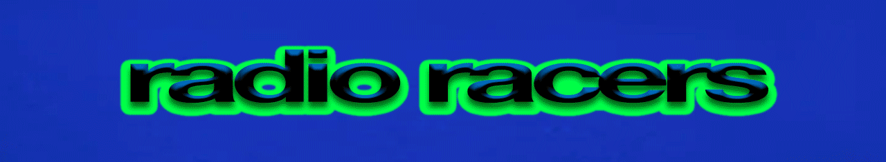

<picture>
  
</picture>

A [Dr. Robotnik's Ring Racers](https://www.kartkrew.org/) fork.
 <small>Last updated for **v2.4**.</small>

This build &ndash; like _all_ software &ndash; is always a work in progress. 
Compatible with the vanilla client; all changes made so far are client-side.

> [!IMPORTANT]
> For hosting servers, it is **strongly** advised to use the vanilla client instead.

> Many thanks to [GenericHeroGuy](https://github.com/GenericHeroGuy) for his work on [`pk3make.py`](https://github.com/GenericHeroGuy/ringracers-scripts), which is used to automate the building process for the assets.

## Netgames

If you plan on using this build online or you're a server owner, read [this](./radio/netgames/README.md).

## Features

Including, but not limited to:

Hudfeed

A live feed that displays in-game events, including player interactions and race statistics, such as grades. 

Both its position within the HUD and content can be customized in the settings.

Emotes

Support for chat emotes, both animated and static. A set of default emotes is included.

For details on customization, such as adding your own emotes and usability tips, check the [readme](./radio/emotes/README.md).

Peek

In the Server Browser, you can "peek" into a server to view key details, such as the current level and connected players.

...and [more](https://github.com/blondedradio/RadioRacers/pulls?q=is%3Apr+label%3Aenhancement).

## Getting Started
1. Get the [**latest copy**](https://www.kartkrew.org/) of Dr. Robontik's Ring Racers installed on your system.
2. Download the latest assets (`radioracers_assets.zip`) for this build [here](https://github.com/blondedradio/RadioRacers/releases/latest-radio-assets/).
3. Extract the `radioracers_assets.zip` into the ***same directory*** where you installed Ring Racers.
     - If you've installed Ring Racers in `C:\Games\Ring Racers`, then **that's** the folder you want to extract the zip file in.
4. [Compile](#compiling) the build (`ringracers_radioracers.exe`) and copy it into the ***same directory*** where you installed Ring Racers.
5. Run `ringracers_radioracers.exe`.

### Compiling
If you don't know how to compile, you can either: 
* attempt it yourself (good practice)
* or ask someone you trust to do it for you

If you do grab a build from — say — a random Discord channel, *please* encourage whoever shared it to include [MD5 hashes](https://linuxsecurity.com/features/what-are-checksums-why-should-you-be-using-them) with the executable. It's spooky out here.

#### Linux

I recommend following the [instructions](https://github.com/KartKrewDev/RingRacers?tab=readme-ov-file#development) in the original README to compile the build on Linux. 

> But if you wish to compile with Clang, here are the presets of interest: 
> 
> * **ninja-x64_windows_vcpkg-debug**
> * **ninja-x64_windows_vcpkg-develop**
> * **ninja-x64_windows_vcpkg-release**
> 
> You'll most likely want `ninja-x64_windows_vcpkg-release`.

#### Windows
If you're on Windows 10 (or above), try following Eidolon's [guide](https://ringracers.miraheze.org/wiki/User:Eidolon/Ring_Racers_Build_Guide).

---

Original README [here](https://github.com/KartKrewDev/RingRacers?tab=readme-ov-file#dr-robotniks-ring-racers).

