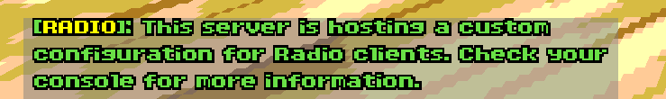
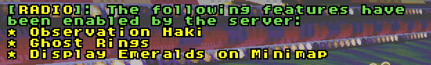

# Netgames

By default, the following Radio features will be disabled during online play:

* [Observation Haki](https://github.com/blondedradio/RadioRacers/pull/7)
* [Ghost Rings](https://github.com/blondedradio/RadioRacers/pull/11)
* [Display Emeralds on Minimap](https://github.com/blondedradio/RadioRacers/pull/8)

However, the client now checks for a custom server config, allowing server owners to enable these features at their descretion. More information below.

## For Players

If you join a server that is hosting a custom server config, you will be greeted by this notice in your chatbox:

Depending on the config, the console will show you exactly which features the server has allowed:

## For Server Owners

A sample server config (`radioracers_servcfg.pk3`) is included in the latest [assets](https://github.com/blondedradio/RadioRacers/releases/latest-radio-assets/) (`radioracers_assets.zip`).  Inside it is a text lump called `RADIO_SERVCFG`, which is where you enable features for Radio users.

You can load `radioracers_servcfg.pk3` directly as an addon or copy the `RADIO_SERVCFG` lump into another file.